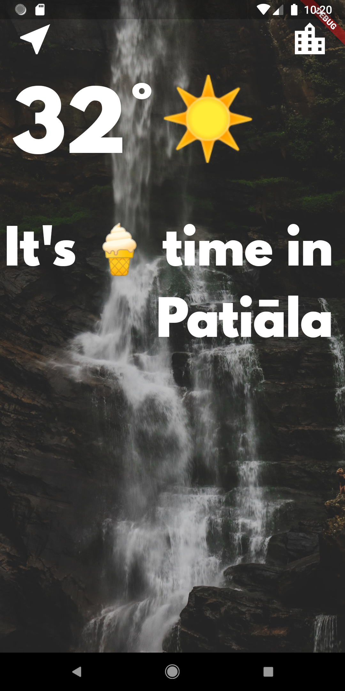
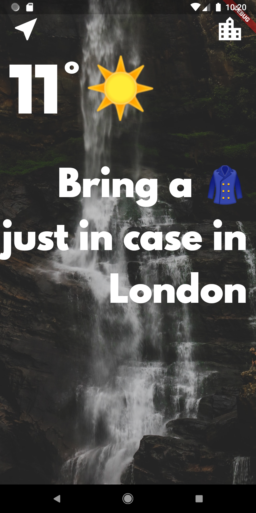
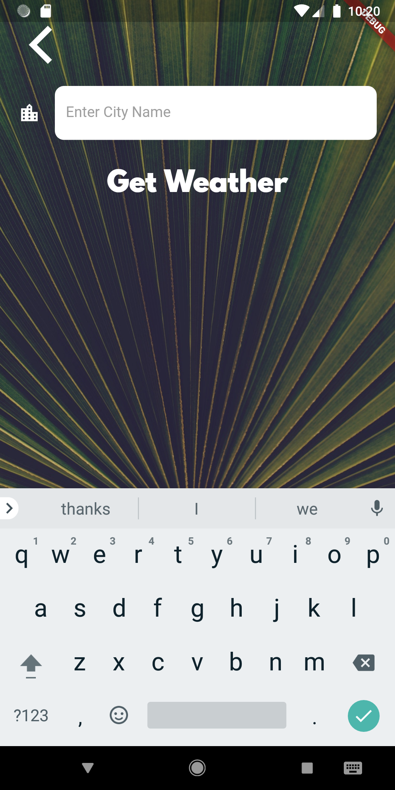

<h1>Clima - A Simple Weather Application</h1>
I made this application by learning from a Udemy Course taught by  <a href="https://github.com/angelabauer"> Angela Yu</a>. Thanks to her. 
 

<h2> Download Android App - <a href="https://github.com/ismaan1998/Clima---a-weather-app---Flutter/raw/master/app-release.apk">Click here</a>
<h2> Screenshots -</h2> 

<h2>Demo </h2>-

 

<b>Things I learned</b> 

- Asynchronous programming (async, await)
- Location services in flutter (Using GeoLocator package)
- lifecycle of states
- NULL Handling in Dart
- Working with get APIs 
- Working with spin kit 
- Passing data to states in stateful widgets
- Working with text-fields
- Passing data backwards using Navigation Stack

